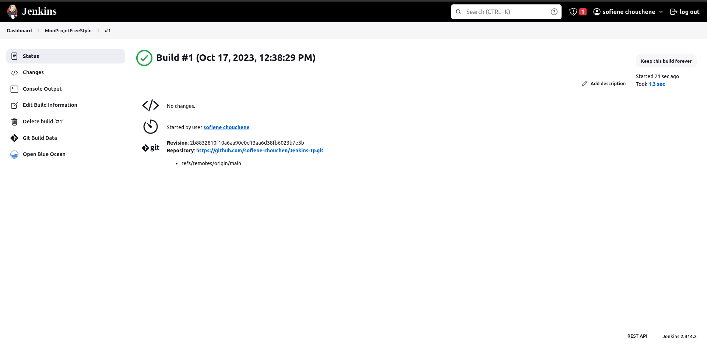

# Jenkins-Tp

Comprendre l'intégration continue : Acquérir une compréhension de base du concept d'intégration continue et de la manière dont Jenkins facilite l'automatisation des tâches de développement logiciel.

## FreeStyle Project

c'est just pour comprendre comment jenkins fonctionne

## Pipline project

en a crée un jenkinsFile dans notre code source pour la premier fois en fait le build manuel a l'aide de plugin blueOcean on peux voir de manier plus claire

si en fait un changment de code et en push dans github le build se lance automatic

